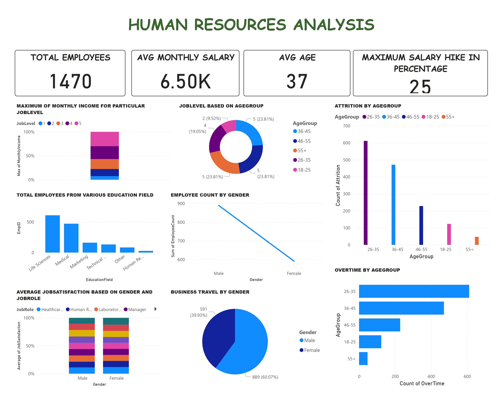

# HR Analysis Visualization in Power BI

## Introduction
This repository contains an HR Analysis Visualization created in Power BI. The goal of this project is to analyze and visualize key HR metrics, such as employee attrition, job satisfaction, and performance, to support data-driven decision-making within an organization.

## Dataset Overview
The dataset used in this analysis was sourced from Kaggle and includes features such as employee demographics, job roles, satisfaction levels, and attrition status.

### Key Features:
- **Employee ID**: Unique identifier for each employee.
- **Age**: Employee age.
- **Department**: Department of the employee.
- **Job Role**: Specific role within the department.
- **Job Satisfaction**: Employee’s job satisfaction level.
- **Attrition**: Whether the employee has left the company.
- **Performance Rating**: Rating of the employee's performance.

## Power BI Dashboard
The Power BI dashboard provides visual insights into various HR metrics:

- **Overview**: Summary of employee demographics and key HR indicators.
- **Attrition Analysis**: Visual representation of employee attrition trends by department, age, and job satisfaction.
- **Performance Analysis**: Employee performance ratings, with comparisons across job roles and departments.
- **Satisfaction & Engagement**: Analysis of job satisfaction scores across different segments of the workforce.

### Dashboard Screenshot

